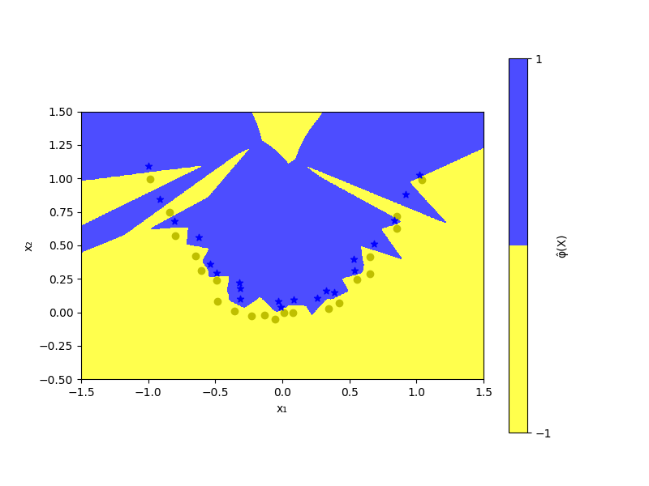
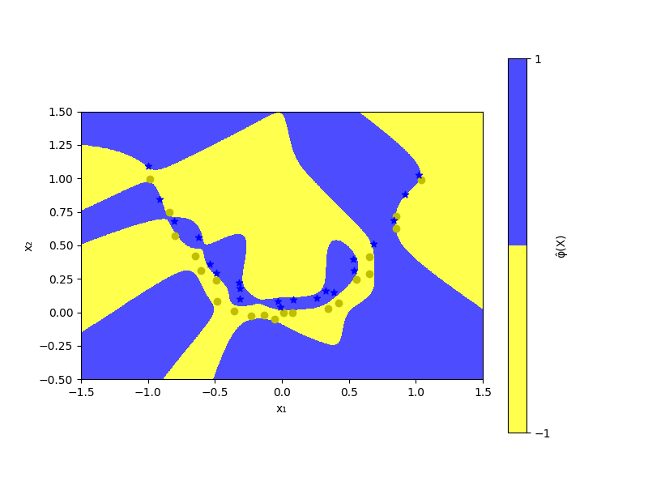
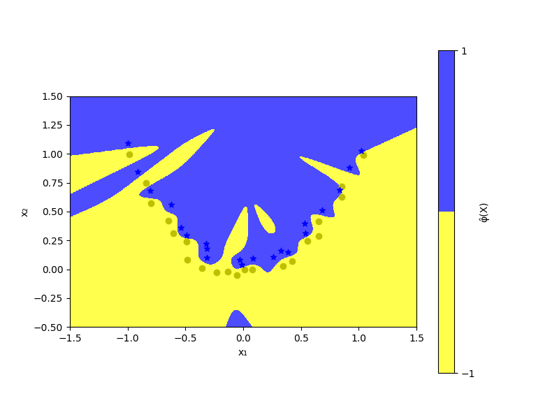
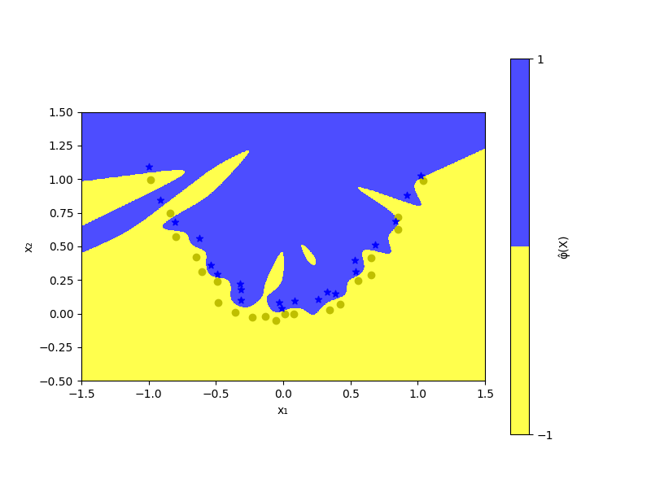
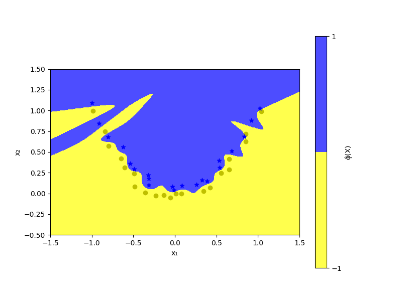

# Kernel-Based Classification / Clustering of 2D Points

A classifier can be trained on a data set in order to learn the patterns and associations between features and labels. It can then be used for prediction of tags to new data.

## Overview
This project implements a kernel-based classifier to distinguish between two classes, "stars" and "circles," in a 2D space. By using the Gaussian kernel (RBF), we project data into a higher-dimensional space where the classes are linearly separable, demonstrating the power of kernel methods in machine learning.


## Kernel Theory

### Kernel Functions
A kernel function is a measure of similarity between two data points in the feature space. Instead of explicitly transforming data into a high-dimensional space, we use the kernel trick to compute the dot product in this space implicitly, which reduces computational cost. For two points, $X$ and $Y$, a kernel function $K(X, Y)$ satisfies:

- **Symmetry**: $K(X, Y) = K(Y, X)$
- **Positive semi-definiteness**: All eigenvalues of the kernel matrix must be non-negative.

### Gaussian (RBF) Kernel
For this project, we use the Gaussian kernel, defined as:
```math
K(X, Y) = e^{-\frac{1}{h} \|X - Y\|^2}
```
where:
- $h$ is a positive hyperparameter that controls the spread of the kernel.
- $\|X - Y\|^2$ denotes the squared Euclidean distance between points $X$ and $Y$.

The Gaussian kernel is highly effective in situations where data are not linearly separable in the input space, as it maps the data into a higher-dimensional space where a linear separator can often be found.

### Probability Density Approximation with Kernels
In machine learning, kernel functions are also used to approximate probability density functions (PDFs) of distributions, as explored in section "Άσκηση 1" of the report. Given a dataset, we can estimate the PDF by summing the contributions of Gaussian kernels centered at each data point:
$$f(x) = \frac{1}{n} \sum_{i=1}^{n} K(x - x_i, h)$$
where:
- $n$ is the number of data points.
- $x_i$ are the individual data points.
- $h$ is the bandwidth parameter, affecting the smoothness of the estimated density.

In our project, we utilize the Gaussian kernel to classify data points based on their distances in the feature space, enabling a smooth decision boundary.

## Methodology

### Objective Function
We set up an optimization problem to find a function $\phi(X)$ that correctly classifies the "stars" and "circles." Our objective is to minimize the classification error, regularized by the norm of $\phi(X)$:
$$
\min_{\phi \in V} \left\{ \sum_{X_i \in \text{stars}} \left(1 - \phi(X_i)\right)^2 + \sum_{X_j \in \text{circles}} \left(1 + \phi(X_j)\right)^2 + \lambda \|\phi(X)\|^2 \right\}
$$
where:
- $V$ is the vector space defined by the kernel function.
- $\lambda$ is a regularization parameter that controls overfitting.

### Representer Theorem and Solution
According to the Representer Theorem, we can approximate $\phi(X)$ as a linear combination of kernel functions centered at each data point:
$$
\hat{\phi}(X) = \sum_{X_i \in \text{stars}} \alpha_i K(X, X_i) + \sum_{X_j \in \text{circles}} \beta_j K(X, X_j)
$$
where $\alpha_i$ and $\beta_j$ are coefficients obtained by solving the optimization problem.

The regularization term $\|\phi(X)\|^2$ can be simplified by noting that:
$$
\|\phi(X)\|^2 = \|\hat{\phi}(X)\|^2 + \|\phi(X) - \hat{\phi}(X)\|^2 \geq \|\hat{\phi}(X)\|^2
$$
allowing us to substitute $\hat{\phi}(X)$ in the objective function for computational efficiency.

### Classification Decision Rule
For a new data point $X_{\text{new}}$, the classifier assigns:
- "stars" (label $1$) if $\hat{\phi}(X_{\text{new}}) > 0$
- "circles" (label $-1$) if $\hat{\phi}(X_{\text{new}}) \leq 0$

### Implementation
The implementation involves solving the system of equations to find $\alpha_i$ and $\beta_j$, followed by plotting the decision boundary. Various values of $h$ and $\lambda$ can be experimented with to observe their effects on the classifier's performance.

## Results
The decision boundary visualization shows clear separation of "stars" and "circles" in the feature space. Observations include:
- **Effect of $h$**: Smaller $h$ values lead to sharper decision boundaries but risk overfitting.
- **Effect of $\lambda$**: Higher $\lambda$ values create smoother boundaries, helping to reduce overfitting.

| ‎                  |  ‎                  |
|---------------------------|--------------------------|
| h=0.001, λ=0   | h=0.01, λ=0   |
| h=0.1, λ=0   |h=0.01, λ=0.01   |
| h=0.01, λ=0.05   |h=0.01, λ=0.2   |

---
---

For more information, you can look at the report files greek or english `report_gr`, `report_en` (pending) respectively.

## Requirements
- Python 3
- Libraries: `numpy`, `matplotlib`, `scipy.io`

## Files
- **`2.py`**: Core code for kernel-based classification.
- **`data32.mat`**: Input data file containing "stars" and "circles" matrices.

## Conclusion
This project illustrates the application of kernel methods in classification tasks, leveraging the Representer Theorem for efficient optimization. The Gaussian kernel enables transformation to a higher-dimensional space, making it easier to apply linear classification methods to non-linearly separable data.

