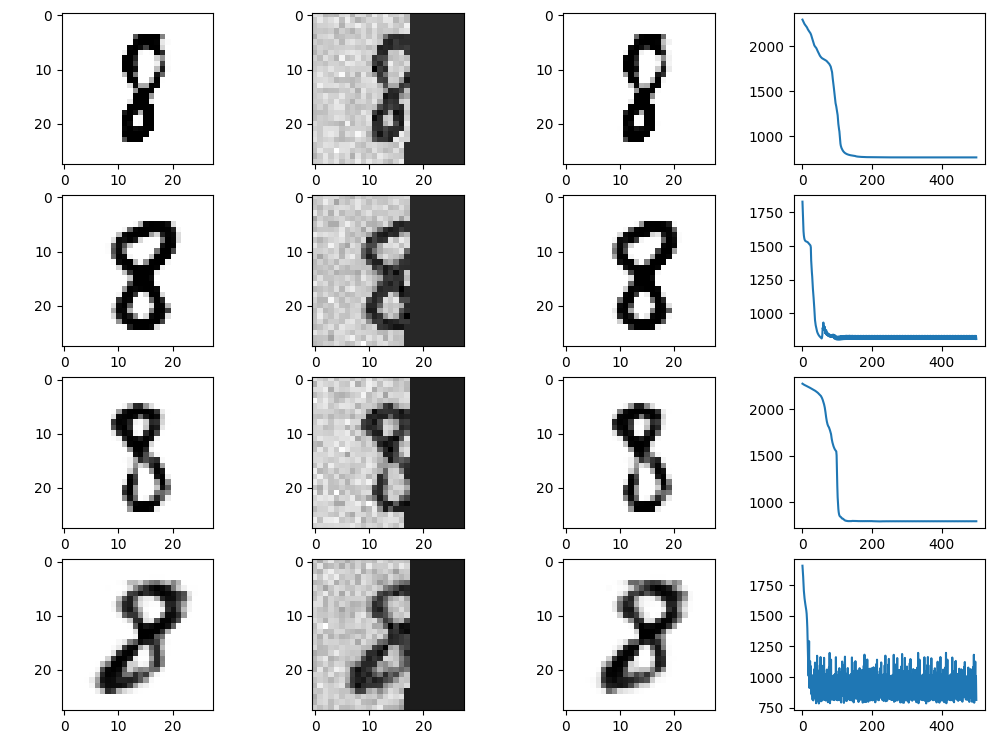
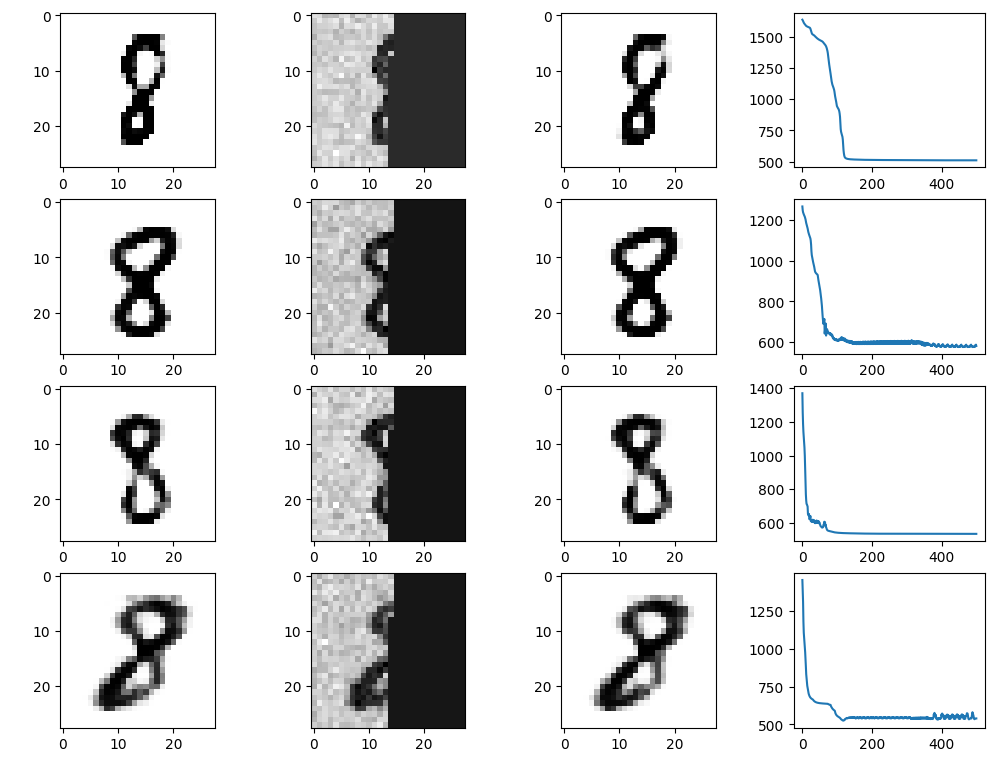
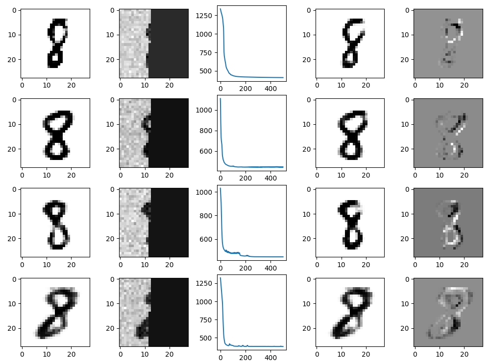
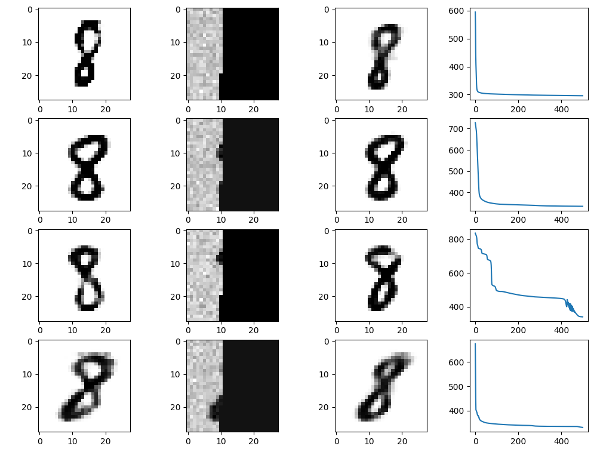

# Inpainting with GANs

## Overview
❗This folder is a sequel of the project presented in the [Generator](https://github.com/FireCoder-N/machine-learning/tree/main/Generator) folder. The file `ex21.py` from there is also imported and used here.

---

This project focuses on the problem of **image inpainting**, where missing parts of an image are reconstructed using **Generative Adversarial Networks (GANs)**. The implemented method generates highly realistic image restorations by iteratively optimizing a latent representation through **backpropagation**.

## Methodology
1. **Data Preparation:**
   - The dataset contains images with dimensions 28x28, flattened as column vectors of size **784**.
   - A subset of the image (**N elements**) is retained, while the rest is removed.
   - Noise from a **normal distribution (mean μ=0, variance σ²=unknown)** is added.
   - We experimented with **N = 500, 400, 350, 300**, so that we can see the accuracy of the prediction decreasing.

2. **GAN-based Reconstruction:**
   - A **pre-trained GAN generator** (from `ex21.py`) is used to reconstruct the missing image parts.
   - Given a random latent vector **Z**, the generator produces an output.
   - The error **J** between the generated output and the available part of the input image is computed.
   - Instead of updating network weights, the **input Z is optimized** using gradient descent.

3. **Mathematical Formulation:**
   - To retain only the first **N** elements, we use a transformation matrix **T**:
     
     T = [I 0]
     
     where **I** is an identity matrix of shape **N×N**, and **0** is a zero matrix of shape **N×(784−N)**. Thus, the resulting **Nx784** matix is right muliplied by Implementation X_i
   
   - The cost function **J** is defined as:
     
     $J = N \cdot \log(|| X_n - T \cdot X ||^2) + Z^T Z$
   
   - The backpropagation updates the input **Z** rather than model parameters, as it would typically heppen during the training of a neural network.

4. **Training and Optimization:**
   - The learning rate and the number of epochs were chosen via **trial and error**.
   - For each run, the network does not always produce perfect reconstructions for all 4 X_i.
   - One possible solution would be to train many neural networks in parallel and finally select the one with the smallest error for each input, but here the simpler approach of demonstrating the best results, after several trials for each N, has been adopted.
   - However, in the current implementation, the simpler approach of **selecting and displaying the best results** after multiple trials was adopted.

## Results
Each row in the results section corresponds to an inpainting experiment on digit '8':
- **Column 1:** Original ideal digit \(X_i\)
- **Column 2:** Corrupted input image \(X_n\)
- **Column 3:** Error convergence plot (cost function over iterations)
- **Column 4:** Final output from the GAN
- **Column 5:** Error visualization was additionally plotted for **N = 350**, showing the difference **X_i - G(X)** (original - reconstruction), where:
   - **Dark pixels** indicate incorrect additions to the final output. 
   - **Bright pixels** indicate parts of the original image that were not reconstructed properly.

### N=500

### N=400

### N=350

### N=300
